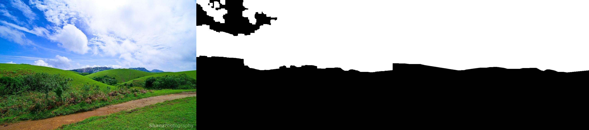

# Lab01 Reflection

## Effectiveness of approach
My **edge detection based method(Pipeline2)** shows that it can effectively find the sky boundaries and is robust enough for pictures of different scenes
(clear/cloudy/sunrise/sunset). On the test dataset I collected, I obtained an IOU score of **0.9013**, which outperforms the Pipeline1 by **40%**. 

Here are some visualization results of Pipeline2, the left-most image is original image, the mask in the middle is generated sky mask,
and the right-most image is the ground-truth mask.

## Limitations and potential improvement
- Both Two pipelines only leverage partial information of a image, color information and structure information respectively. Finding 
a way to better mix these to pipeline could lead to a better performance.
- In Pipeline1, static color thresholds have limited adaptability to diverse skies. Using dynamic thresholds computed per image could help.
- In Pipeline2, Hard-coded contours filtering strategy sometimes may fail. More carefully fine-tuned parameters in my strategy may improve the performance.
- Here are some failure cases:

## Learning Outcomes
- Practiced implementing an image processing pipeline using OpenCV.
- Learned how color, edge and morphological information can be combined to segment objects.
- Understood importance of adapting algorithms based on image conditions and edge cases.
- Realized modern deep learning techniques are better suited for robust scene understanding.