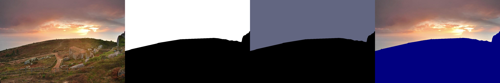
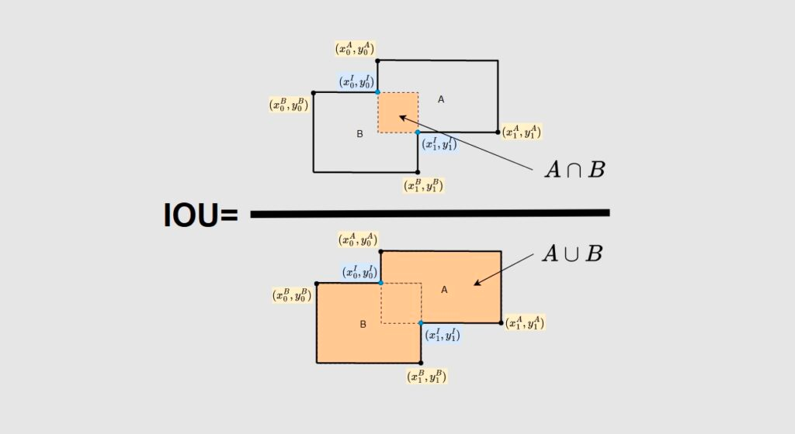
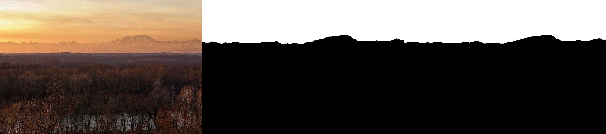

# Lab 01 Sky Pixel Identification

## Intro
-  This is a small project aiming at using traditional computer vision techniques to generate sky segmentations of the given images. My algorithm
has robustness to different scenarios.
## Dataset
- *Source*: [Alibaba Tianchi Landscape Dataset](https://tianchi.aliyun.com/dataset/93849?t=1705880857133)
- *Annotation Tool*: [Baidu PaddleSeg]()
- *Basic info*: This sky image dataset contains **50** images and their corresponding sky label maps/pseudo color maps/cutout images.
  - *Data Format*: 
    - image path: ```./dataset/images/{name}.jpg```
    - label map path: ```./dataset/labels/{name}.png```
    - pseudo color map path: ```./dataset/labels/{name}_pseudo.png```
    - cutout image path: ```./dataset/labels/{name}_cutout.png```
  - *example*:
    
- *Statistic info*

  | clear | cloudy | sunset/sunrise | total |
  |-------|--------|----------------|-------|
  | 17    | 20     | 13             | 50    |

## Metrics
- I use IOU(intersection over union) as the evaluation metrics. The higher the IOU, the better segmentation method.
  - 
- Formula
  - ```IOU = TP / (TP + FN + FP)```

## Usage
- **Evaluation**: generate the sky masks of all test images in `dataset` and calculate the `IOU`.
  - run the following scripts in your terminal
    ``` 
    cd lab01-Pixel_Identification
    # evaluate the thresholding-based method
    python eval.py -thres 
    # evaluate the edge detection based method
    python eval.py -edge
    ```
  - you can find the generated visualization results in `./result`, the left-most image is original image, the mask in the middle is generated sky mask,
  and the right-most image is the ground-truth mask.
    
  - you can also find the calculated `IOU` in your terminal. Here are my evaluation results on different segmentation methods:
    
    | -   |Thresholding|Edge Detection|
    |-----|-|-|
    | IOU |0.5225|0.9013|
- **Demo**: launch the sky replacement demo and have fun!
  - ```
    cd lab01-Pixel_Identification
    python app.py
    ```

## Citation
- https://docs.opencv.org/3.4/d2/d2c/tutorial_sobel_derivatives.html
- https://docs.opencv.org/3.4/df/d0d/tutorial_find_contours.html
- https://www.gradio.app/guides/quickstart
- https://www.mathworks.com/help/images/morphological-dilation-and-erosion.html
