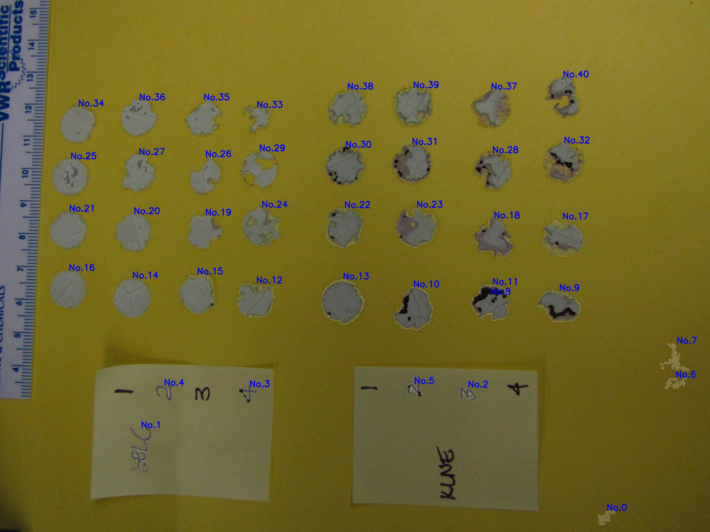
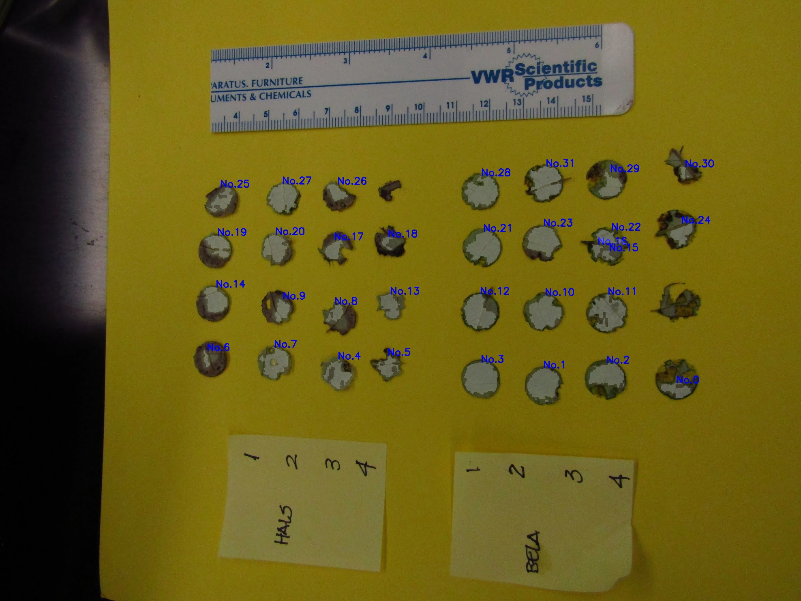

# Lab01 Reflection

## Effectiveness of approach
My **thresholding based method(Pipeline1)** and **edge detection based method(Pipeline2)** show that it can effectively find most of the leaf areas and is robust enough for pictures of different backgrounds. 
On the test dataset which contains 12 test images, I obtained an IOU score of **0.8596** on Pipeline1 and **0.7923** on Pipeline2, which excessively outperform the Pipeline3. 

Here are some visualization results of my three pipelines:

## Limitations 
- Lacks a robust model for different leaf types and lighting conditions. Current methods use hand-tuned parameters and heuristics and sometimes can not
extract all leaves successfully.
- Some parameters in these pipelines are hardcoded. Making them adaptive would improve robustness.
- Limited to a small set of segmentation techniques. More advanced algorithms like graph cuts, active contours, neural networks etc. are not explored.
- Here are some failure cases:

    

        
        
        
    

## Potential improvements
- Test more segmentation algorithms like GrabCut, CNN-based semantic segmentation etc.
- Post-process segments to regularize shapes and refine boundaries.
- Use a interactive way to choose reference patch in Pipeline3 could result in a better performance.

## Learning Outcomes
- Gained practical experience in implementing common image processing and computer vision algorithms like thresholding, edge detection, morphological operations etc. in OpenCV and NumPy.
- Appreciated the need for parameter tuning and custom handling for different image types and conditions. A single technique does not fit all scenarios.
- Understood challenges in real world conditions like lighting, occlusions, perspectives that affect segmentation performance.
