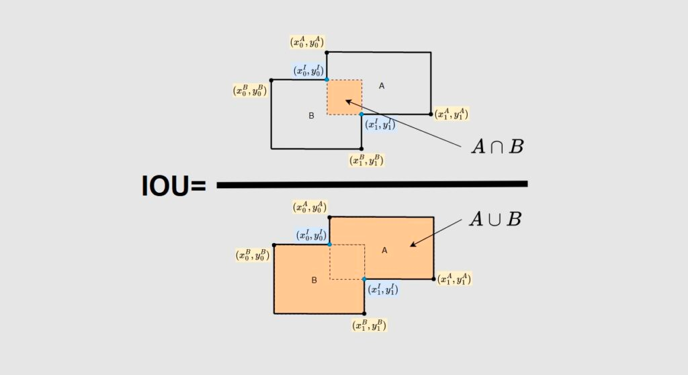
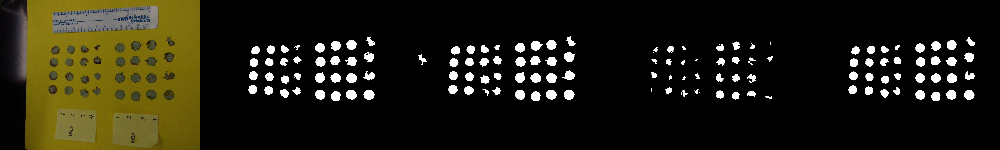
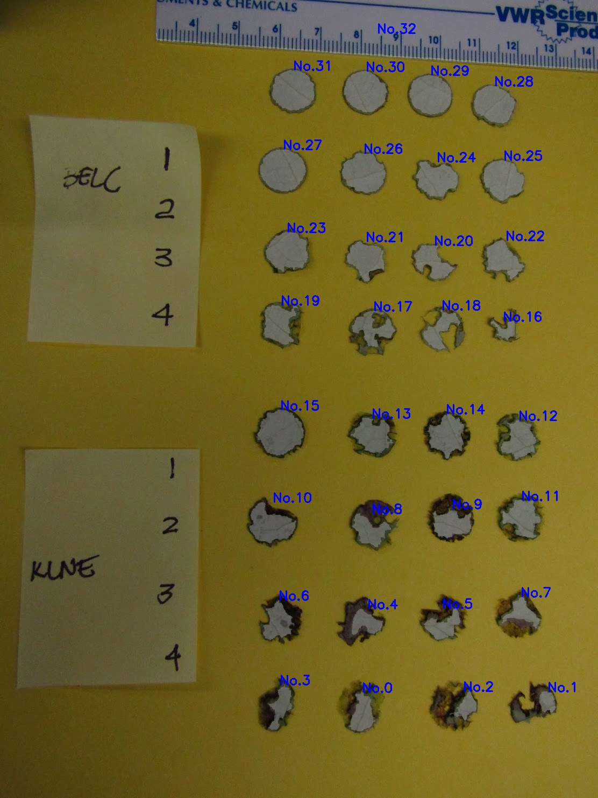

# Lab 02 Image Segmentation and Size Estimation

## Intro
-  This is a small project aiming at using traditional computer vision techniques to generate leaf segmentations of the given images and estimate the 
size of segmented area.

## Dataset
- *Source*: [Deparment of Biological Science at University of Toronto](https://www.utsc.utoronto.ca/labs/gonzalesvigil/)
- *Annotation Tool*: [Baidu PaddleSeg](https://ai.baidu.com/tech/imageprocess/sky_seg)
- *Basic info*: I chose images with yellow background to build the dataset, which contains **12** images and their corresponding leaf label maps/pseudo color maps/cutout images.
  - *Data Format*: 
    - image path: ```./dataset/images/{name}.jpg```
    - label map path: ```./dataset/labels/{name}.png```
    - pseudo color map path: ```./dataset/labels/{name}_pseudo.png```
    - cutout image path: ```./dataset/labels/{name}_cutout.png```
    - sample patch coordinate json path: ```./dataset/patch_coord.json```
  - *example*:
    


## Metrics
- I use IOU(intersection over union) as the evaluation metrics. The higher the IOU, the better segmentation method.
  - 
- Formula
  - ```IOU = TP / (TP + FN + FP)```

## Usage
- *Evaluation*: generate the leaf masks of all test images in `dataset` and calculate the `IOU`.
  - run the following scripts in your terminal
    ``` 
    cd lab02-Image_Segmentation
    # evaluate the three segmentation methods
    python eval.py
    ```
  - you can find the generated visualization results in `./result`, from left to right, the visualization results are **original image, 
  thresholding-based predicted mask, edge-detection-based predicted mask, rg-chromaticity-based mask, ground truth**.
    
  - you can also find the calculated `IOU` in your terminal. Here are my evaluation results on different segmentation methods:
    
    | -   | Thresholding | Edge Detection | RG-Chromaticity |
    |-----|--------------|----------------|-----------------|
    | IOU | 0.8596       | 0.7923         | 0.4192          |

- *Inference*: generate the areas of every leaf in the picture. In particular, for **rg-chromaticity method, you need to 
  specify** the patch coordinate for segmentation reference. 
  ``` 
    cd lab02-Image_Segmentation
    # inference using the thresholding-based method
    python inference.py --image_path ./dataset/images/IMG_2786.JPG --out_dir ./out -thres 
    # inference using the edge detection based method
    python inference.py --image_path ./dataset/images/IMG_2786.JPG --out_dir ./out -edge 
    # inference using the rg-chromaticity based method
    python inference.py --image_path ./dataset/images/IMG_2786.JPG --out_dir ./out --patch_coord 180,200,520,540 -rg
    ```
  - You can find the output image in the out_dir.
  
  - Also, you can find the corresponding pixel area in your terminal.
  
- *Threshold Calculation:* calculate the threshold used in thresholding-based method.
  ```
  cd lab02-Image_Segmentation
  python calc_thres.py
  ```

## Citation
- https://docs.opencv.org/3.4/d2/d2c/tutorial_sobel_derivatives.html
- https://docs.opencv.org/3.4/df/d0d/tutorial_find_contours.html
- https://towardsdatascience.com/image-processing-with-python-using-rg-chromaticity-c585e7905818
- https://www.mathworks.com/help/images/morphological-dilation-and-erosion.html
